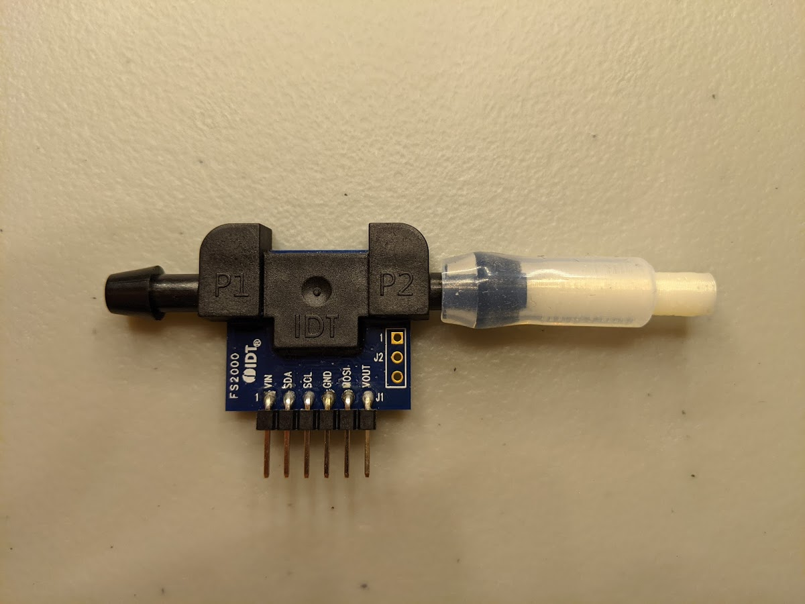

# miniPID flow sensor

This device measures the flow rate of the [Aurora Scientific 200B miniPID](https://aurorascientific.com/products/legacy-applications/environmental-monitoring/minipid-dispersion-sensor/) photo-ionization detector. At its heart lies a Renesas FS2012-1020-NG calibrated mass flow sensor, which is rated for 0 to 2 SLPM. [Will Dickson](https://github.com/willdickson) wrote the [original firmware and software](https://github.com/willdickson/fs2012_flow_sensor), which I slightly modified. 

## Hardware

### BOM

In addition to standard electronics equipment and access to a 3D-printer:

| Item                       | Price (USD)    | Quantity | Source                                                       |
| -------------------------- | -------------- | -------- | ------------------------------------------------------------ |
| FS2012-1020-NG             | 94.90          | 1        | DigiKey  [800-3797-ND](https://www.digikey.com/en/products/detail/renesas-electronics-america-inc/FS2012-1020-NG/7645225?s=N4IgjCBcoLQBxVAYygMwIYBsDOBTANCAPZQDaIcADJSALoC%2B9hATGSAGIDKzlYzMYSjxgA5AOJ16QA) |
| Arduino Nano (clone)       | 13.99 / 3      | 1        | Amazon  ASIN: [B0713XK923](https://www.amazon.com/ELEGOO-Arduino-ATmega328P-Without-Compatible/dp/B0713XK923/ref=sr_1_2_sspa?dchild=1&keywords=arduino+nano+clone&qid=1614064204&sr=8-2-spons&psc=1&spLa=ZW5jcnlwdGVkUXVhbGlmaWVyPUEzUDZEOUk0VThIM1BIJmVuY3J5cHRlZElkPUEwMTUxMDMwMkhZV1dXNVdQRk43OCZlbmNyeXB0ZWRBZElkPUEwNjcwMjY5M0tNOEVIT0dVR1BLSiZ3aWRnZXROYW1lPXNwX2F0ZiZhY3Rpb249Y2xpY2tSZWRpcmVjdCZkb05vdExvZ0NsaWNrPXRydWU=) |
| Silicone tubing (3/16" ID) | 7.99 / 10 feet | 1        | Amazon  ASIN: [B07TH8H1QP](https://www.amazon.com/gp/product/B07TH8H1QP/ref=ppx_yo_dt_b_asin_title_o02_s00?ie=UTF8&th=1) |

The sensor can be swapped out for an alternative Renesas FS2012-series sensor, such as the [FS2012-1100-NG](https://www.digikey.com/en/products/detail/renesas-electronics-america-inc/FS2012-1100-NG/7645220?s=N4IgjCBcoLQBxVAYygMwIYBsDOBTANCAPZQDaIcADJSALoC%2B9hATGSAGIDKzlYzMYMNRgA5AOJ16QA), which is rated for 0 to 10 SLPM. 

The adaptor between the FS2012 sensor and the long metal PID inlet is 3D-printed. The measured OD of the PID's metal inlet is approximately **1.30 mm**. In my experience, printing an exact 1.30 mm ID hole on an FDM printer is tricky, and requires some trial and error. I provide a [`.gcode` file](CAD_files/PID_flow_sensor_for_prusa_mk3s_0.2mm_PLA_MK3S_9m) that worked for me on a Prusa MK3S with Prusament PLA. Adjustments can be made with the provided [`.step` file](CAD_files/PID_flow_sensor_for_prusa_mk3s.step). A corresponding [`.stl` file](CAD_files/PID_flow_sensor_for_prusa_mk3s.stl) is also provided.

Alternatively, if trial and error fiddliness is undesirable, print the adaptor from a printing service, such as [Shapeways](https://www.shapeways.com/), and use a somewhat compliant material, such as PA11. For this route, an alternative adaptor with a direct ID that matches the PID's OD is provided in this [`.stl` file](CAD_files/PID_flow_sensor_for_serviced_PA11.stl). (TODO: test this design file.)

### Hook-up

| Arduino Nano pin                             | FS2012 sensor pin |
| -------------------------------------------- | ----------------- |
| 5 V                                          | VIN               |
| GND                                          | GND               |
| A5 or A6 (can be modified in `firmware.ino`) | VOUT              |

The firmware supports up to two flow sensors, for which GND and VIN are common. 

### Assembly

Use the silicone tubing to secure the components together. The assembled sensor, prior to electrical hook-up, might look something like this:

### Additional notes

Clean the inside of the 3D-printed adaptor prior to use. I recommend going through the channel with some kind of filament (e.g. some solder) to clear away large particulate debris. Then, apply some air pressure through the channel to rid of any remaining particulates. 

A photo of the sensor in use:

TODO: Attach photo

## Data collection

TODO